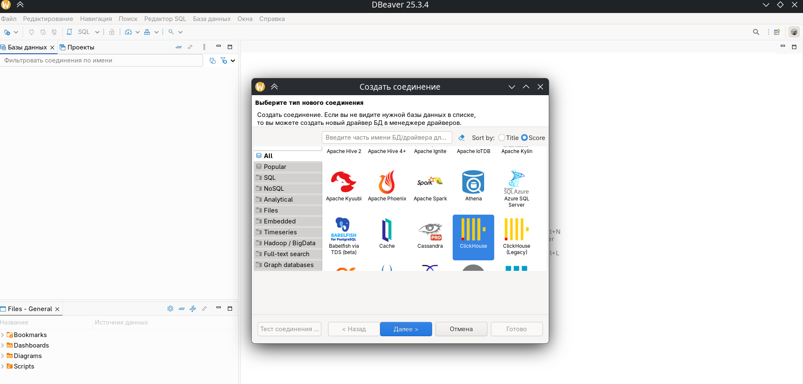
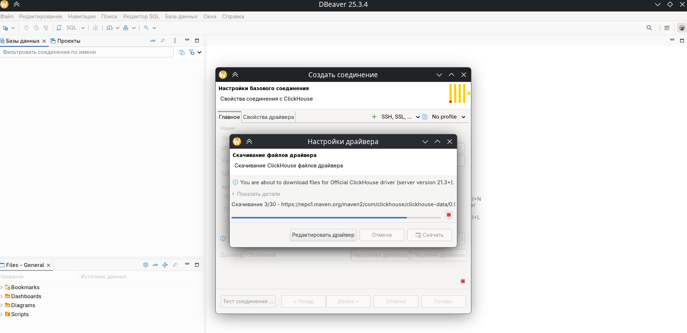
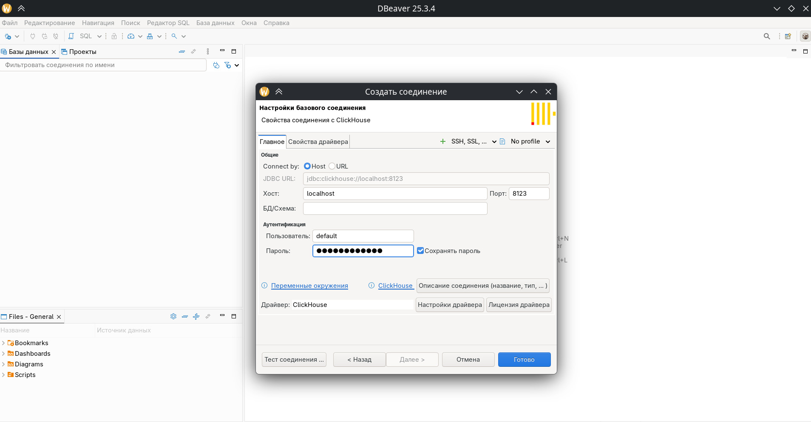
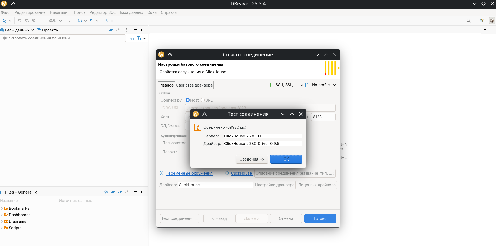
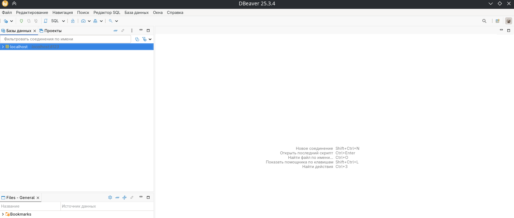
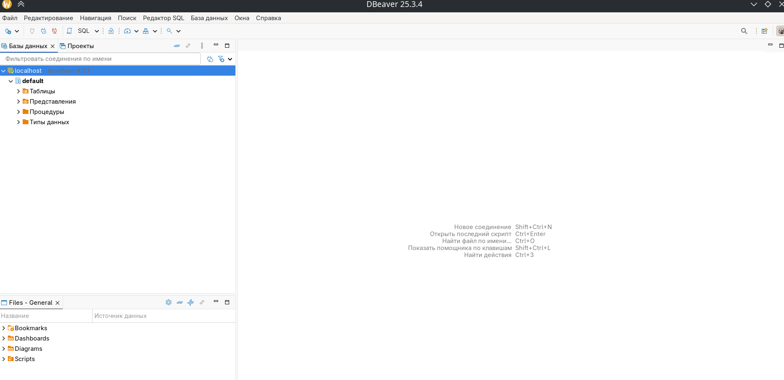

# Установка и подключение ClickHouse + DBeaver на ALT Linux


- - -
## 📋 Содержание

- [Требования](#-требования)
- [Установка DBeaver Community](#-установка-dbeaver-community)
- [Установка ClickHouse](#-установка-clickhouse)
-
  [Настройка пароля для пользователя default](#-настройка-пароля-для-пользователя-default)
- [Подключение DBeaver к ClickHouse](#-подключение-dbeaver-к-clickhouse)
- [Проверка](#-проверка)
- [Управление автозагрузкой](#-управление-автозагрузкой)
- [Полезные SQL-команды](#-полезные-sql-команды)
- [Управление пользователями](#-управление-пользователями)
- [Смена пароля пользователя default](#-смена-пароля-пользователя-default)
- [Полезные команды](#-полезные-команды)
- [Примечания](#-примечания)

- - -
## 🖥 Требования


|Компонент        |Версия                                  |
|-----------------|----------------------------------------|
|ОС               |ALT Workstation K 11.2 (Nemorosa) x86_64|
|Пакетный менеджер|apt-get (ALT Linux)                     |
|Flatpak          |для установки DBeaver                   |
|ClickHouse       |25.8.10.7-alt1 (из репозитория p11)     |
|DBeaver Community|25.3.4+                                 |

- - -
## 📦 Установка DBeaver Community


DBeaver Community Edition отсутствует в официальных репозиториях ALT Linux,
поэтому устанавливаем через **Flatpak** из **Flathub**:

```bash
flatpak install flathub io.dbeaver.DBeaverCommunity
```
> 💡 Убедитесь, что Flatpak установлен и репозиторий Flathub подключён.

- - -
## 🗄 Установка ClickHouse


ClickHouse доступен в **официальных репозиториях ALT Linux p11** — сторонние
репозитории не нужны.

### Шаг 1 — Обновить список пакетов

```bash
sudo apt-get update
```
### Шаг 2 — Установить ClickHouse

```bash
sudo apt-get install clickhouse-server clickhouse-client
```
Будут установлены три пакета:

- `clickhouse-common-static` — общие файлы (~82 МБ)
- `clickhouse-client` — клиент командной строки
- `clickhouse-server` — сервер (~67 МБ)

> ⚠️ Суммарный объём после установки: ~834 МБ

### Шаг 3 — Запустить и добавить в автозагрузку

```bash
sudo systemctl enable --now clickhouse-server
```
### Шаг 4 — Проверить статус

```bash
sudo systemctl status clickhouse-server
```
### Шаг 5 — Подключиться через CLI-клиент

```bash
clickhouse-client
```
Успешное подключение выглядит так:

```
ClickHouse client version 25.8.10.1.
Connecting to localhost:9000 as user default.
Connected to ClickHouse server version 25.8.10.
:)
```
Для выхода из клиента:

```sql
exit
```
- - -
## 🔐 Настройка пароля для пользователя `default`


В версии ClickHouse 25.x пароль для подключения **обязателен**. Пользователь `
default` хранится в read-only конфиге, поэтому пароль задаётся через файл в
директории `users.d`.

### Шаг 1 — Создать директорию (если не существует)

```bash
sudo mkdir -p /etc/clickhouse-server/users.d
```
### Шаг 2 — Исправить основной конфиг

В файле `/etc/clickhouse-server/users.xml` по умолчанию присутствует тег `
\<password></password>`, который конфликтует с файлами из `users.d`. Необходимо
заменить его на `\<no_password/>`:

```bash
sudo sed -i 's|<password></password>|<no_password/>|' /etc/clickhouse-server/users.xml
```
### Шаг 3 — Создать файл с паролем

```bash
sudo nano /etc/clickhouse-server/users.d/default-password.xml
```
Вставить содержимое:

```xml
<clickhouse>
    <users>
        <default>
            <no_password remove="1"/>
            <password>ваш_пароль</password>
        </default>
    </users>
</clickhouse>
```
Сохранить: `Ctrl+O` → `Enter` → `Ctrl+X`

### Шаг 4 — Перезапустить сервер

```bash
sudo systemctl restart clickhouse-server
```
### Шаг 5 — Проверить подключение с паролем

```bash
clickhouse-client --user default --password "ваш_пароль"
```
- - -
## 🔌 Подключение DBeaver к ClickHouse

### Шаг 1 — Создать новое соединение

Открыть DBeaver и нажать **База данных → Новое соединение с базой данных** или `
Shift+Ctrl+N`.

### Шаг 2 — Выбрать драйвер ClickHouse

В списке драйверов найти и выбрать **ClickHouse** (не ClickHouse Legacy), нажать **
Далее**.

 *Выбор драйвера ClickHouse (не
Legacy) в диалоге создания соединения*

### Шаг 3 — Скачать JDBC-драйвер

DBeaver предложит скачать официальный JDBC-драйвер ClickHouse. Нажать **Скачать**.

 *Автоматическое скачивание
ClickHouse JDBC Driver 0.9.5 из репозитория Maven*

> Будет загружен: `ClickHouse JDBC Driver 0.9.5`

### Шаг 4 — Заполнить параметры подключения


|Параметр    |Значение         |
|------------|-----------------|
|Хост        |`localhost`      |
|Порт        |`8123`           |
|БД/Схема    |*(оставить пустым)*|
|Пользователь|`default`        |
|Пароль      |`ваш_пароль`     |

 *Заполненные параметры подключения:
хост localhost, порт 8123, пользователь default*

### Шаг 5 — Протестировать соединение

Нажать **Тест соединения ...**.

 *Успешное подключение: ClickHouse
25.8.10.1, драйвер ClickHouse JDBC Driver 0.9.5*

Успешный результат:

```
✅ Соединено (69980 мс)
Сервер:   ClickHouse 25.8.10.1
Драйвер:  ClickHouse JDBC Driver 0.9.5
```
### Шаг 6 — Сохранить соединение

Нажать **Готово**. Соединение `localhost:8123` появится в панели **Базы данных**.

- - -
## ✅ Проверка

После успешного подключения в панели **Базы данных** отобразится соединение с
иконкой ClickHouse.

 *Соединение localhost:8123 успешно
добавлено в панель «Базы данных»*

Можно раскрыть его и увидеть системные базы данных:

 *Структура соединения: база данных
default с таблицами, представлениями, процедурами и типами данных*

- `default`
- `INFORMATION_SCHEMA` / `information_schema`
- `system`

- - -
## ⚙️ Управление автозагрузкой

```bash
# Включить автозагрузку
sudo systemctl enable clickhouse-server

# Отключить автозагрузку
sudo systemctl disable clickhouse-server

# Проверить статус автозагрузки
sudo systemctl is-enabled clickhouse-server
```
Команда `is-enabled` вернёт `enabled` или `disabled`.

- - -
## 💡 Полезные SQL-команды

Выполняются внутри `clickhouse-client`:

```sql
-- Узнать версию сервера
SELECT version();

-- Показать все базы данных
SHOW DATABASES;

-- Показать все таблицы в текущей БД
SHOW TABLES;

-- Показать всех пользователей
SHOW USERS;

-- Показать права пользователя
SHOW GRANTS FOR default;
```
- - -
## 👤 Управление пользователями

### Создать нового пользователя (plaintext)

```sql
CREATE USER имя_пользователя IDENTIFIED WITH plaintext_password BY 'пароль';
```
### Создать пользователя с SHA256-паролем (рекомендуется)

Сначала сгенерировать хэш в терминале:

```bash
echo -n "пароль" | sha256sum | awk '{print $1}'
```
Затем в `clickhouse-client`:

```sql
CREATE USER имя_пользователя IDENTIFIED WITH sha256_hash BY 'хэш';
```
### Выдать права пользователю

```sql
-- Все права на базу данных
GRANT ALL ON название_бд.* TO имя_пользователя;

-- Только чтение
GRANT SELECT ON название_бд.* TO имя_пользователя;
```
### Удалить пользователя

```sql
DROP USER имя_пользователя;
```
### Показать всех пользователей

```sql
SHOW USERS;
```
- - -
## 🔄 Смена пароля пользователя `default`


### Вариант 1 — Через файл конфига (plaintext)

> ⚠️ Простой способ, но пароль хранится в открытом виде. Подходит для локальной
> разработки.

**Шаг 1** — Отредактировать файл:

```bash
sudo nano /etc/clickhouse-server/users.d/default-password.xml
```
Заменить содержимое:

```xml
<clickhouse>
    <users>
        <default>
            <no_password remove="1"/>
            <password>новый_пароль</password>
        </default>
    </users>
</clickhouse>
```
**Шаг 2** — Перезапустить сервер:

```bash
sudo systemctl restart clickhouse-server
```
**Шаг 3** — Обновить пароль в DBeaver: правой кнопкой на `localhost` → **
Редактировать соединение** → ввести новый пароль → **Готово**.

- - -
### Вариант 2 — SHA256-хэш (рекомендуется) ✅

> 💡 Безопасный способ — пароль в открытом виде нигде не хранится.

**Шаг 1** — Сгенерировать хэш нового пароля:

```bash
echo -n "новый_пароль" | sha256sum | awk '{print $1}'
```
> ⚠️ Убедитесь что хэш содержит ровно **64 символа** — иначе сервер не запустится.

**Шаг 2** — Записать хэш в файл конфига одной командой:

```bash
echo -n "новый_пароль" | sha256sum | awk '{print $1}' | xargs -I{} sudo sh -c 'cat > /etc/clickhouse-server/users.d/default-password.xml << EOF
<clickhouse>
    <users>
        <default>
            <no_password remove="1"/>
            <password_sha256_hex>{}</password_sha256_hex>
        </default>
    </users>
</clickhouse>
EOF'
```
**Шаг 3** — Проверить файл (хэш должен быть 64 символа):

```bash
sudo cat /etc/clickhouse-server/users.d/default-password.xml
```
**Шаг 4** — Перезапустить сервер:

```bash
sudo systemctl restart clickhouse-server
```
**Шаг 5** — Обновить пароль в DBeaver: правой кнопкой на `localhost` → **
Редактировать соединение** → ввести новый пароль → **Готово**.

- - -
## 🗒 Полезные команды

```bash
# Статус сервера
sudo systemctl status clickhouse-server

# Запуск / остановка / перезапуск
sudo systemctl start clickhouse-server
sudo systemctl stop clickhouse-server
sudo systemctl restart clickhouse-server

# Включить / отключить автозагрузку
sudo systemctl enable clickhouse-server
sudo systemctl disable clickhouse-server

# Подключение через CLI
clickhouse-client --user default --password "ваш_пароль"

# Версия клиента
clickhouse-client --version
```
- - -
## 📌 Примечания

>
> 
>
> Не используйте простые пароли в рабочей среде. Рекомендуется хранить пароль в
> виде SHA256-хэша.
>
>
> 
>
> ClickHouse использует два порта: **8123** (HTTP, для JDBC/DBeaver) и **9000**
> (нативный протокол, для CLI-клиента).
>
>
> 
>
> Если сервер не запускается после смены пароля — убедитесь что в
> `/etc/clickhouse-server/users.xml` нет тега `\<password></password>`. Исправить
> можно командой:
>
> ```bash
> sudo sed -i 's|<password></password>|<no_password/>|' /etc/clickhouse-server/users.xml
> ```
- - -
*Инструкция подготовлена для ALT Workstation K 11.2 (Nemorosa) x86_64*

