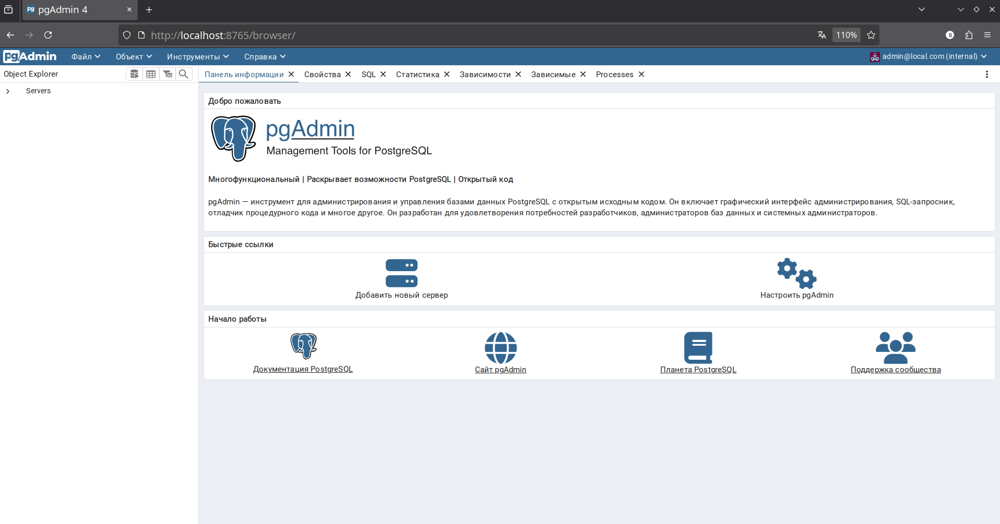
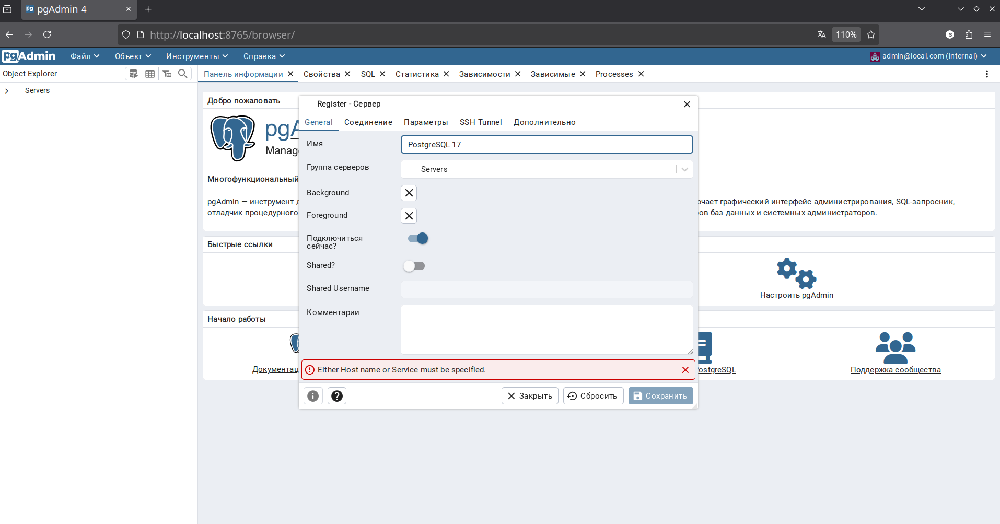
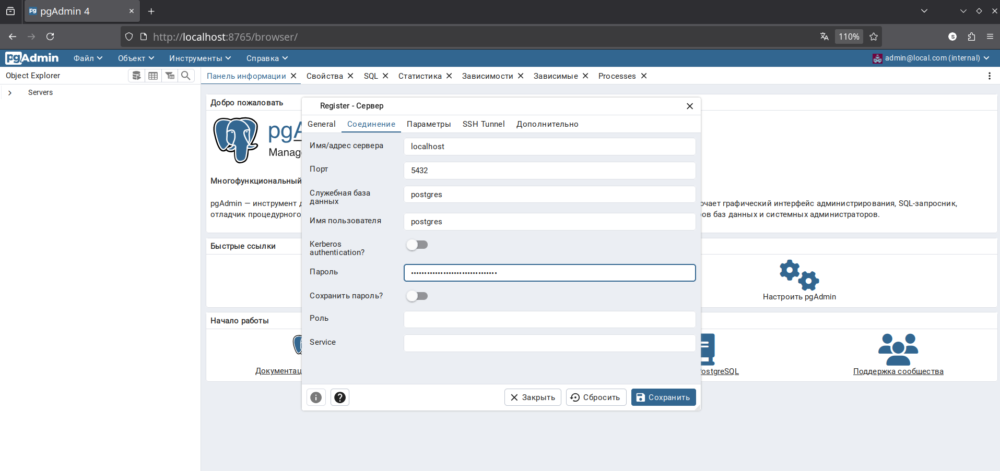
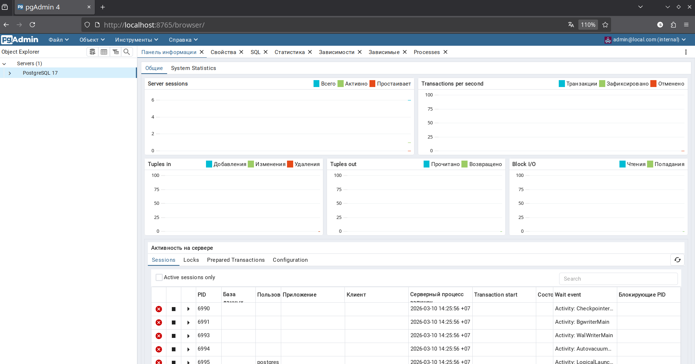
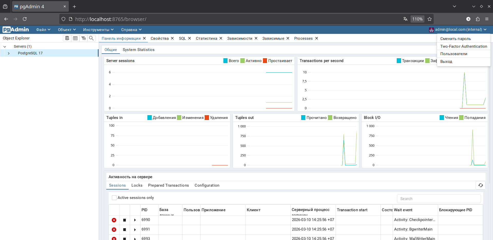
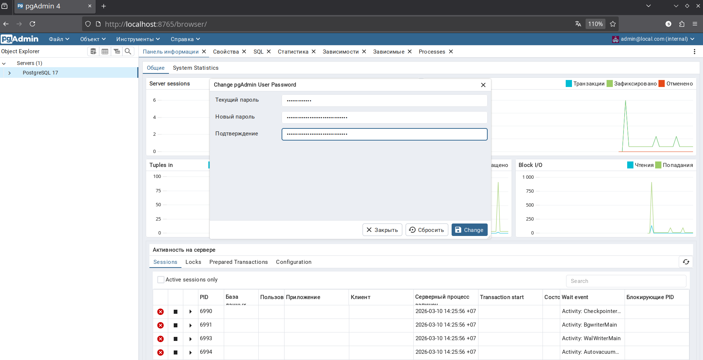

# 🐘 PostgreSQL 17 + pgAdmin 4 на ALT Workstation K


> Пошаговое руководство по установке и настройке **PostgreSQL 17**, **postgresql-contrib** и **pgAdmin 4**
> на операционной системе **ALT Workstation K 11.2 (Nemorosa)** x86_64.

---

## 📋 Содержание

- [🐘 PostgreSQL 17 + pgAdmin 4 на ALT Workstation K](#-postgresql-17--pgadmin-4-на-alt-workstation-k)
  - [📋 Содержание](#-содержание)
  - [📦 Требования](#-требования)
  - [🔄 Шаг 1 — Обновление списка пакетов](#-шаг-1--обновление-списка-пакетов)
  - [📥 Шаг 2 — Установка пакетов](#-шаг-2--установка-пакетов)
  - [🗄️ Шаг 3 — Инициализация базы данных](#️-шаг-3--инициализация-базы-данных)
  - [🔐 Шаг 4 — Настройка аутентификации](#-шаг-4--настройка-аутентификации)
  - [▶️ Шаг 5 — Запуск служб](#️-шаг-5--запуск-служб)
  - [👤 Шаг 6 — Создание учётной записи pgAdmin](#-шаг-6--создание-учётной-записи-pgadmin)
  - [🖥️ Шаг 7 — Подключение к PostgreSQL в pgAdmin](#️-шаг-7--подключение-к-postgresql-в-pgadmin)
    - [Вкладка General](#вкладка-general)
    - [Вкладка Соединение](#вкладка-соединение)
    - [Смена пароля pgAdmin](#смена-пароля-pgadmin)
  - [🛠️ Полезные команды](#️-полезные-команды)
    - [Управление PostgreSQL](#управление-postgresql)
    - [Управление pgAdmin 4](#управление-pgadmin-4)
    - [Работа с psql](#работа-с-psql)
    - [Сброс пароля суперпользователя](#сброс-пароля-суперпользователя)
  - [📁 Важные пути](#-важные-пути)

---

## 📦 Требования

| Компонент | Версия |
|-----------|--------|
| ОС | ALT Workstation K 11.2 (Nemorosa) x86\_64 |
| PostgreSQL | 17.7 |
| pgAdmin | 4 (8.3) |
| Права | `sudo` |

---

## 🔄 Шаг 1 — Обновление списка пакетов

```bash
sudo apt-get update
```

---

## 📥 Шаг 2 — Установка пакетов

Устанавливаем PostgreSQL 17, contrib и pgAdmin 4 одной командой:

```bash
sudo apt-get install -y postgresql17 postgresql17-server postgresql17-contrib pgadmin4
```

---

## 🗄️ Шаг 3 — Инициализация базы данных

```bash
sudo /etc/init.d/postgresql initdb
```

В процессе система попросит задать пароль суперпользователя `postgres` — **запомните его**, он понадобится для подключения в pgAdmin.

**Пример успешного вывода:**

```
Creating default database:
Кластер баз данных будет инициализирован с локалью "ru_RU.UTF-8".
Кодировка БД по умолчанию: "UTF8".
...
Success. You can now start the database server using:
  service postgresql start
```

---

## 🔐 Шаг 4 — Настройка аутентификации

По умолчанию PostgreSQL использует метод `scram-sha-256`, который не поддерживается pgAdmin 4. Заменяем на `md5`:

```bash
sudo sed -i 's/scram-sha-256/md5/g' /var/lib/pgsql/data/pg_hba.conf
```

> ⚠️ **Важно:** Этот шаг нужно выполнить **до** первого запуска PostgreSQL, иначе pgAdmin не сможет подключиться.

---

## ▶️ Шаг 5 — Запуск служб

Запускаем PostgreSQL и pgAdmin 4, добавляем оба в автозагрузку:

```bash
sudo systemctl enable --now postgresql
sudo systemctl enable --now pgadmin4
```

Проверяем статусы:

```bash
sudo systemctl status postgresql
sudo systemctl status pgadmin4
```

-brightgreen?style=flat-square)
-brightgreen?style=flat-square)

pgAdmin 4 запускается на порту **8765** (`http://localhost:8765`).

---

## 👤 Шаг 6 — Создание учётной записи pgAdmin

Создаём администратора для входа в веб-интерфейс pgAdmin:

```bash
sudo EVENTLET_NO_GREENDNS=yes python3 /usr/lib/pgadmin4/setup.py add-user admin@local.com 'MyPassword123' --admin
```

> ⚠️ **Важно:** Замените `MyPassword123` на свой надёжный пароль. **Запомните его** — он понадобится для входа в веб-интерфейс pgAdmin.

**Ожидаемый вывод:**

```
          User Details
+-------------------------------+
| Field       | Value           |
|-------------+-----------------|
| Email       | admin@local.com |
| auth_source | internal        |
| role        | Admin           |
| active      | True            |
+-------------------------------+
```

> 💡 Переменная `EVENTLET_NO_GREENDNS=yes` необходима для обхода бага совместимости между `eventlet` и `trio`.

> 🔒 **Если аккаунт заблокирован:** pgAdmin блокирует учётную запись после 3 неверных попыток входа. Для разблокировки выполните:
> ```bash
> sudo sqlite3 /var/lib/pgadmin4/pgadmin4.sql "UPDATE user SET login_attempts=0 WHERE email='admin@local.com';"
> sudo systemctl restart pgadmin4
> ```

---

## 🖥️ Шаг 7 — Подключение к PostgreSQL в pgAdmin

Откройте браузер и перейдите на `http://localhost:8765`. Войдите с данными из шага 6:
- **Email:** `admin@local.com`
- **Пароль:** тот, что вы указали в команде на шаге 6



Добавьте сервер через **Объект → Регистрация → Сервер**:

### Вкладка General

| Поле | Значение |
|------|----------|
| Имя | `PostgreSQL 17` |

### Вкладка Соединение

| Поле | Значение |
|------|----------|
| Имя/адрес сервера | `localhost` |
| Порт | `5432` |
| Служебная база данных | `postgres` |
| Имя пользователя | `postgres` |
| Пароль | *(пароль из шага 3)* |

> ⚠️ **Важно:** В поле **Имя пользователя** укажите именно `postgres`, а не `admin` или другое имя.

Нажмите **Сохранить** — сервер появится в **Object Explorer** с дашбордом активности.







### Смена пароля pgAdmin

После входа вы можете сменить пароль: нажмите на **`admin@local.com`** в правом верхнем углу → **Сменить пароль**.





---

## 🛠️ Полезные команды

### Управление PostgreSQL

```bash
sudo systemctl start postgresql           # Запуск
sudo systemctl stop postgresql            # Остановка
sudo systemctl restart postgresql         # Перезапуск
sudo systemctl status postgresql          # Статус
sudo systemctl enable postgresql          # Добавить в автозагрузку
sudo systemctl disable postgresql         # Убрать из автозагрузки
sudo systemctl disable --now postgresql   # Убрать из автозагрузки и остановить
```

### Управление pgAdmin 4

```bash
sudo systemctl start pgadmin4             # Запуск
sudo systemctl stop pgadmin4              # Остановка
sudo systemctl restart pgadmin4           # Перезапуск
sudo systemctl status pgadmin4            # Статус
sudo systemctl enable pgadmin4            # Добавить в автозагрузку
sudo systemctl disable pgadmin4           # Убрать из автозагрузки
sudo systemctl disable --now pgadmin4     # Убрать из автозагрузки и остановить
```

### Работа с psql

```bash
# Подключение
sudo -u postgres psql

# Список баз данных
\l

# Список пользователей
\du

# Создать базу данных
CREATE DATABASE mydb;

# Создать пользователя
CREATE USER myuser WITH PASSWORD 'mypassword';

# Выход
\q
```

### Сброс пароля суперпользователя

```bash
sudo -u postgres psql -c "ALTER USER postgres WITH PASSWORD 'новый_пароль';"
```

---

## 📁 Важные пути

| Назначение | Путь |
|------------|------|
| Данные кластера | `/var/lib/pgsql/data/` |
| Конфигурация PostgreSQL | `/var/lib/pgsql/data/postgresql.conf` |
| Аутентификация | `/var/lib/pgsql/data/pg_hba.conf` |
| Логи PostgreSQL | `/var/log/postgres/` |
| pgAdmin 4 | `http://localhost:8765` |

---


